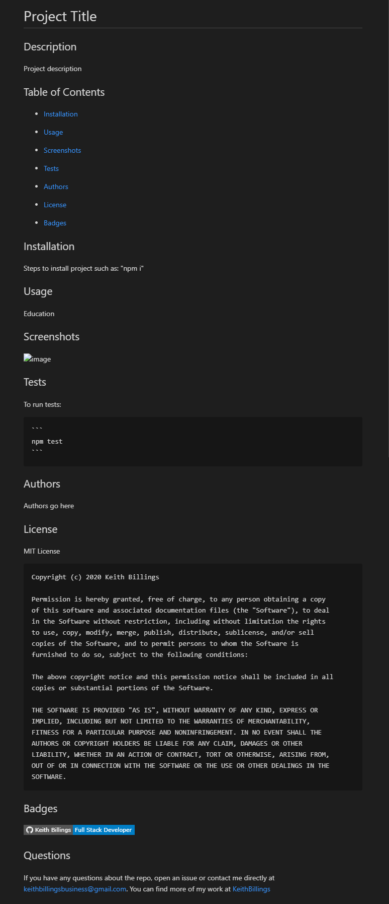

# README-Generator


## Table of Contents

 * [Description](#Description)

 * [Guide](#Guide)

 * [Usage](#usage)

 * [Screenshots](#screenshots)

 * [Author](#Author)

## Description

In this homework assignment I was tasked with creating a command-line application that generates a new README.md file based on user's input. 

The user will be prompted for their GitHub username, project title, description, and other information pertaining to the project the README is for.

The README will be populated with the following:

* Project title
* Description
* Table of Contents
* Installation
* Usage
* Screenshot (If provided file path)
* How to run tests (If applicable)
* Author(s)
* License
* One badge, and a section for more
* If Questions Contact:
  * User GitHub email

## Guide

Upon cloning this repository, install dependencies with the command:

```sh
npm i
```

The application will then be invoked with the command: 

```sh
node index.js
```

## Usage

This will be used as a quick README generator.

## Screenshot



## Author

Keith Billings

